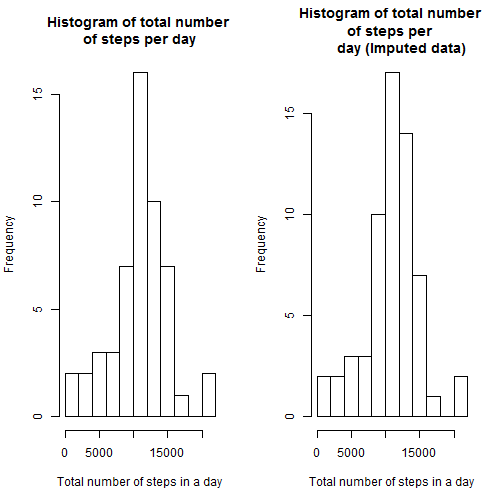

Activity Monitoring Data - Reproducible Research
===================================================

###Loading and preprocessing the data

1. Load the data (i.e. read.csv()).
2. Process/transform the data (if necessary) into a format suitable for your analysis.

Assuming that the file is saved in the working directory, so no explicit path is required for the file.

```r
act_dt<-read.csv("activity.csv",header=TRUE, na.strings="NA")
##review the data
head(act_dt)
```

```
##   steps       date interval
## 1    NA 2012-10-01        0
## 2    NA 2012-10-01        5
## 3    NA 2012-10-01       10
## 4    NA 2012-10-01       15
## 5    NA 2012-10-01       20
## 6    NA 2012-10-01       25
```

###What is mean total number of steps taken per day?

In this section all calculations are done ignoring the NA values in the dataset.

Calculating total number of steps taken per day.

```r
sum_act_dt<-aggregate(steps~date,data=act_dt,FUN="sum", na.rm =TRUE)
##review the data
head(sum_act_dt)
```

```
##         date steps
## 1 2012-10-02   126
## 2 2012-10-03 11352
## 3 2012-10-04 12116
## 4 2012-10-05 13294
## 5 2012-10-06 15420
## 6 2012-10-07 11015
```

Create a histogram of the summarized data.

```r
hist(sum_act_dt$steps, breaks = 10, main="Histogram of total number of steps per day", 
     xlab="Total number of steps in a day")
```

 

Calculate mean and median of the total number of steps taken per day.

```r
median(sum_act_dt$steps, na.rm = TRUE)
```

```
## [1] 10765
```

```r
mean(sum_act_dt$steps, na.rm = TRUE)
```

```
## [1] 10766.19
```

###What is the average daily activity pattern?

Make a time series plot of the 5-minute interval (x-axis) and the average number of steps taken, averaged across all days (y-axis).

First we will aggregate the data accross the interval with mean as function. Then we will plot the data.

```r
mean_act_dt<- aggregate(steps ~ interval, act_dt, FUN="mean")
##check data
head(mean_act_dt)
```

```
##   interval     steps
## 1        0 1.7169811
## 2        5 0.3396226
## 3       10 0.1320755
## 4       15 0.1509434
## 5       20 0.0754717
## 6       25 2.0943396
```

```r
##create plot
with(mean_act_dt, {
  plot(interval, steps, type = "l",xlab="Interval", 
       ylab="Number of Steps", main="Daily Activity Pattern",col="blue")})
```

 

Which 5-minute interval, on average across all the days in the dataset, contains the maximum number of steps?

```r
##check which interval has max number of steps on average
max_int <- mean_act_dt[which.max(mean_act_dt$steps),]
print(max_int)
```

```
##     interval    steps
## 104      835 206.1698
```
###Imputing missing values

The presence of missing days may introduce bias into some calculations or summaries of the data.

First let's look at the total number of missing values in the dataset.

```r
sum(is.na(act_dt$steps))
```

```
## [1] 2304
```

It is natural to assume that the pattern of activity will be different depending on the day of the week. Most of us tend to spend our weekdays and weekends performing different activities during different times of the day. Therefore, we will factor in both interval and day of the week, while filling in the values in the dataset.

1. To fill in the values we would need to convert the date into the day of the week. 
2. Then we will calculate averages for each day of the week and interval combinations.
3. Then we will merge original dataset with the average dataset on day of the week and the interval.
4. Finally, we will create a claculated column that will check if the original value was NA and assign corresponding average value.


```r
##messages are set to false to avoid package loading warnings
require(date) ##loading date package to convert dates into day of the week
```

```
## Loading required package: date
```

```r
##getting days of the week
act_dt$wd <- weekdays(as.Date(act_dt$date))
act_dt$wd <- factor(act_dt$wd, levels= c("Monday", "Tuesday", "Wednesday", 
                               "Thursday", "Friday", "Saturday", "Sunday"))

##calculating average steps per day of the week and interval combinations
avgst <- aggregate(steps ~ interval+wd, data = act_dt, FUN = mean)
##merging original dataset with the aggregation from prior step
act_dt_new <- merge(act_dt, avgst, by=c("wd","interval"))
##creating a column with imputed values
act_dt_new$imp.steps <- ifelse(is.na(act_dt_new$steps.x), 
                                       act_dt_new$steps.y, act_dt_new$steps.x)
##review resulting dataset
head(act_dt_new)
```

```
##       wd interval steps.x       date steps.y imp.steps
## 1 Friday        0       0 2012-10-19       0         0
## 2 Friday        0       0 2012-10-05       0         0
## 3 Friday        0      NA 2012-11-30       0         0
## 4 Friday        0       0 2012-10-12       0         0
## 5 Friday        0       0 2012-11-16       0         0
## 6 Friday        0       0 2012-10-26       0         0
```

Make a histogram of the total number of steps taken each day and Calculate and report the mean and median total number of steps taken per day. Do these values differ from the estimates from the first part of the assignment? What is the impact of imputing missing data on the estimates of the total daily number of steps?


```r
##aggregating imputed values as before
imp_total<-aggregate(imp.steps~date,data=act_dt_new,FUN="sum")
##review data
head(imp_total)
```

```
##         date imp.steps
## 1 2012-10-01  9974.857
## 2 2012-10-02   126.000
## 3 2012-10-03 11352.000
## 4 2012-10-04 12116.000
## 5 2012-10-05 13294.000
## 6 2012-10-06 15420.000
```

```r
##creating a histogram
hist(imp_total$imp.steps, breaks = 10, main="Histogram of total number of steps per 
     day (Imputed data)", xlab="Total number of steps in a day")
```

 

```r
##calculating median and mean
median(imp_total$imp.steps)
```

```
## [1] 11015
```

```r
mean(imp_total$imp.steps)
```

```
## [1] 10821.21
```

Let's review the plots side by side for comparison.

```r
par(mfcol=c(1,2))
hist(sum_act_dt$steps, breaks = 10, main="Histogram of total number \nof steps per day", 
     xlab="Total number of steps in a day")
hist(imp_total$imp.steps, breaks = 10, main="Histogram of total number \nof steps per 
     day (Imputed data)", xlab="Total number of steps in a day")
```

 

Comparison of the graphs shows that the total number of steps in certain frequency buckets increased. As a result we also can observe increase in the median and in mean for imputed data as compared to teh original dataset with missing values.


```r
cat("Original dataset mean - ",mean(sum_act_dt$steps)
      ,". Imputed mean -",mean(imp_total$imp.steps))
```

```
## Original dataset mean -  10766.19 . Imputed mean - 10821.21
```

```r
cat("Original dataset median - ",median(sum_act_dt$steps)
      ,". Imputed median -",median(imp_total$imp.steps))
```

```
## Original dataset median -  10765 . Imputed median - 11015
```

###Are there differences in activity patterns between weekdays and weekends?

To compare weekends to the week days we would need to create a new factor variable in the dataset with two levels - "weekday" and "weekend" indicating whether a given date is a weekday or weekend day.

As a next step we will aggregate, get mean of the data, across both new factor variable and intervals, so we can plot the data for comparison purposes later.


```r
##create new factor variable
for (i in 1:nrow(act_dt_new))
{act_dt_new$day_type[i]<-{if (act_dt_new$wd[i] %in% c("Saturday","Sunday")){"weekend"}else {"weekday"}}}
act_dt_new$day_type<-as.factor(act_dt_new$day_type)
##process aggregation
act_dt_wd<-aggregate(imp.steps~interval+day_type,data=act_dt_new,FUN="mean")
##review data
head(act_dt_wd)
```

```
##   interval day_type  imp.steps
## 1        0  weekday 2.31071429
## 2        5  weekday 0.45000000
## 3       10  weekday 0.17500000
## 4       15  weekday 0.20000000
## 5       20  weekday 0.08888889
## 6       25  weekday 1.56388889
```

Make a panel plot containing a time series plot of the 5-minute interval (x-axis) and the average number of steps taken, averaged across all weekday days or weekend days (y-axis).


```r
require(ggplot2) ##require package to create plot
##creating plot
pl<-qplot(interval, imp.steps, data=act_dt_wd, geom=c("line"), xlab="Interval", 
      ylab="Number of steps", main="Comparison in Number of Steps Weekend vs. Weekday")
pl+  facet_wrap(~day_type, ncol = 1)
```

 

Looking at both plots we can observe a clear distinction between the two. The weekday plot shows more intervals with fewer steps in them, while weekend activities more equaly distributed acorss various step counts. That seems to be reasonable because usually people are more active during the weekends, since most of people now have desk jobs.
